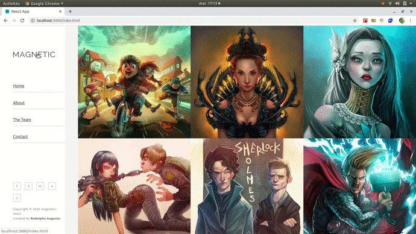

# Magnetic v.1 React -Template (Dispo at V1 branch)
# and
# Magnetic v.2 React -Template (Dispo at V2 branch)

- **Responsive Template made with React, react-router-dom and node-sass**

---

## Quick Links

[Demo](#demo)


- [Picture](#picture-demo)

[Tech Stack](#tech-stack)

[Author](#author)

[License](#license)

---

### Picture Demo
 **Demo V1**

  **Demo V2**


---

## Tech Stack

- [React](https://github.com/facebook/react)
  - Create-react-app with highly complex frontend structure
---


## Author

- Rodolphe Augusto

---

## License

- MIT.

---

## Start project
- Clone this repo https://github.com/rodolphe37/magnetic-react-template.git
- Do in the console :
-    ```$ cd magnetic-react-template```
-    ```$ npm i``` or ```$ npm install ```
to install the dependencies and
-    ```$ npm start```
to start project for personalisation.

enjoy!!!
